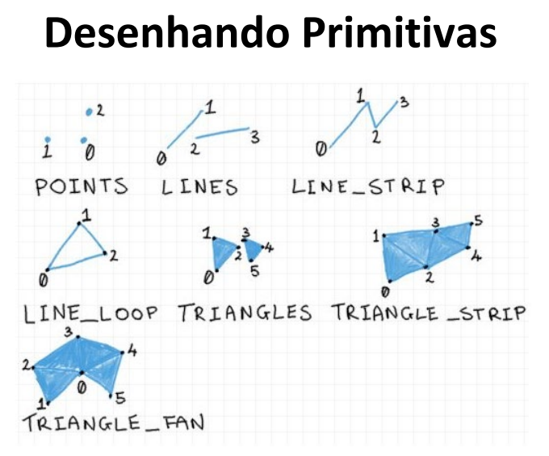
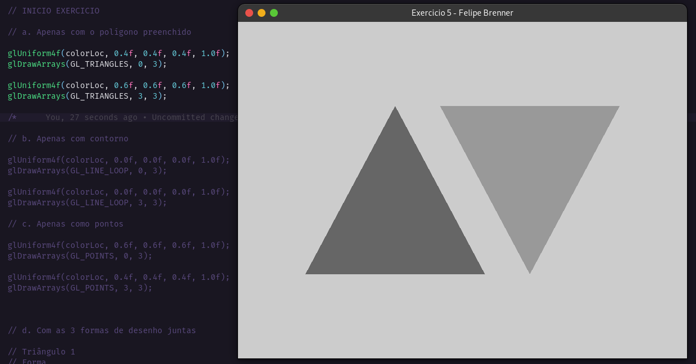
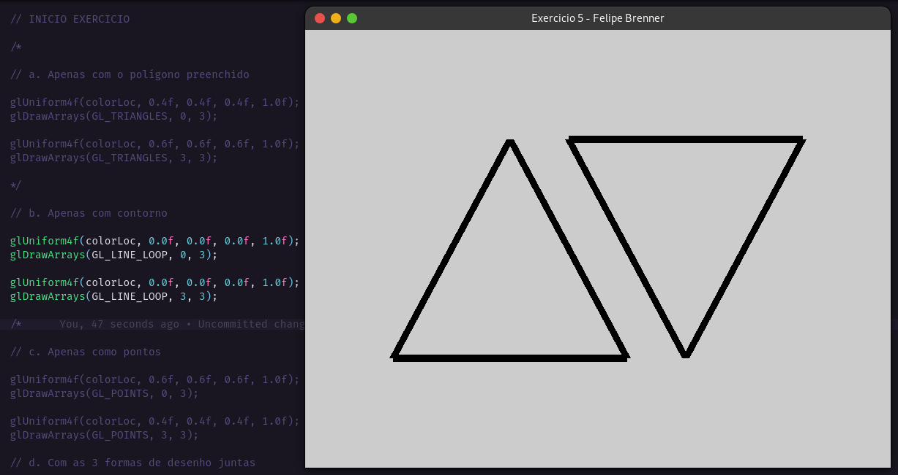
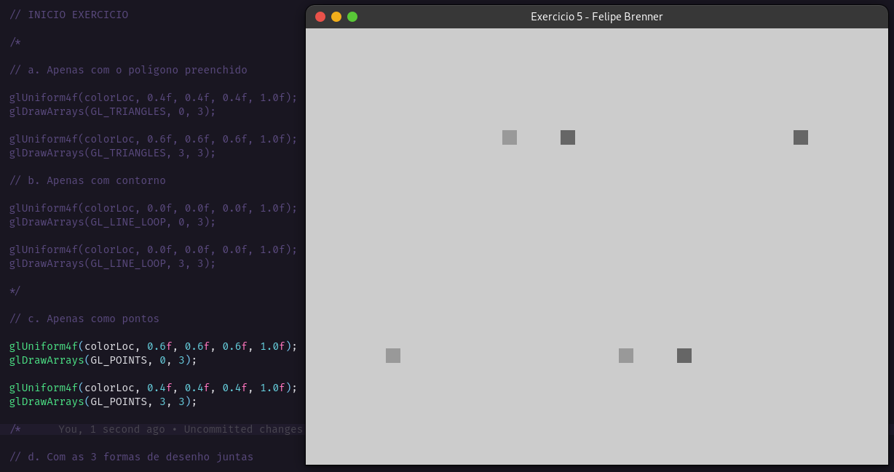
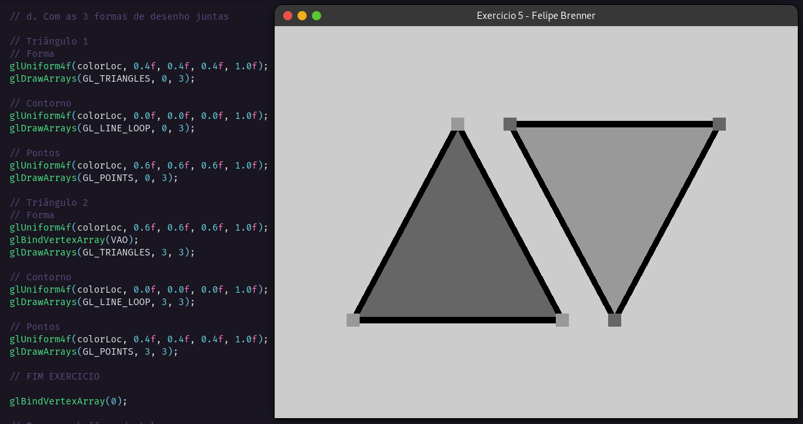

## Introdução à OpenGL Moderna – Shaders & Buffer

<b>1. O que é a GLSL? Quais os dois tipos de shaders são obrigatórios no pipeline programável da versão atual que trabalhamos em aula e o que eles processam?</b>

OpenGL Shading Language (GLSL) é uma linguagem de sombreamento de alto nível com uma sintaxe baseada em C. Os dois tipos obrigatórios de shaders para o OpenGL 4 são o Vertex Shader, que descreve como tratar um vértice, e o Fragment Shader, que descreve como tratar uma área.

<b>2. O que são primitivas gráficas? Como fazemos o armazenamento dos vértices na OpenGL?</b>

As primitivas gráficas são os elementos mais simples que podem ser criados.

- GL_POINTS: pontos
- GL_LINES: linha a cada 2 pontos do array
- GL_LINE_STRIP: linha entre todos os pontos do array do primeiro ao ultimo
- GL_LINE_LOOP: linha entre todos os pontos do array
- GL_TRIANGULOS: triangulo a cada 3 pontos do array
- GL_TRIANGLE_STRIP: triangulos grudados
- GL_TRIANGLE_FAN: triangulo a cada 2 pontos do array sendo que o terceiro ponto é sempre o primeiro do array

<b>3. Explique o que é VBO, VAO e EBO, e como se relacionam (se achar mais fácil, pode fazer um gráfico representando a relação entre eles).</b>

Vertex Buffer Object (VBO) é um buffer que armazena um array de dados (posição, vetores, cores etc) diretamente na memória da GPU, permitindo uma renderização mais rápida. Vertex Array Object (VAO) faz a ligação dos atributos de um vértice, ele define que VBO vai ser usado e a localização e o formato desses dados.

<b>4. Analise o código fonte do projeto Hello Triangle. Localize e relacione os conceitos de shaders, VBOs e VAO apresentados até então. Não precisa entregar nada neste exercício</b>

<b> 5. Faça o desenho de 2 triângulos na tela. Desenhe eles: </b>

a. Apenas com o polígono preenchido

b. Apenas com contorno

c. Apenas como pontos

d. Com as 3 formas de desenho juntas

<b> 6. Faça o desenho de um círculo na tela, utilizando a equação paramétrica do círculo para gerar os vértices. Depois disso: </b>

a) Desenhe um octágono

b) Desenhe um pentágono

c) Desenhe um pac-man!

d) Desenhe uma fatia de pizza

e) DESAFIO: desenhe uma “estrela”
