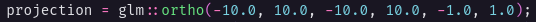
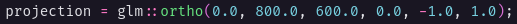
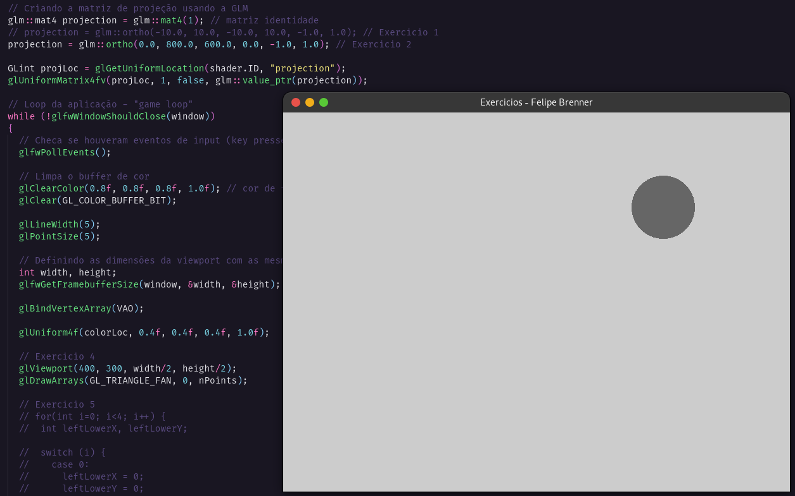
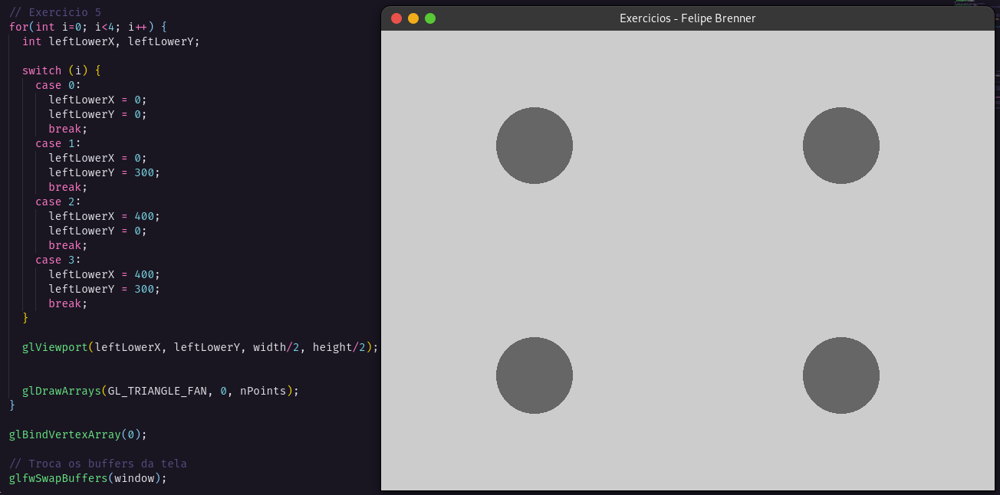

## Introdução à OpenGL Moderna – Sistemas de Coordenadas e Câmera 2D

<b>1. Modifique a janela do mundo (window/ortho) para os limites: xmin=-10, xmax=10, ymin=-10, ymax=10.</b>

<b>2. Agora modifique para: xmin=0, xmax=800, ymin=600, ymax=0.</b>

<b>3. Utilizando a câmera 2D do exercício anterior, desenhe algo na tela. O que acontece quando posicionamos os objetos? Por que é útil essa configuração?</b>

É útil essa configuração para definir as extermidades mínimas e máximas para os eixos x e y, onde inicia e termina, por exemplo foi definido dessa forma acima pois é um padrão normalmente utilizado, começar a contar do canto superior esquerdo. O desenhe algo na tela, desenhei os próprios solicitados nos exercícios seguintes.

<b>4. Modifique o viewport para desenhar a cena apenas no seguinte quadrante da janela da aplicação:</b>

<b>5. Agora, desenhe a mesma cena nos 4 quadrantes.</b>

